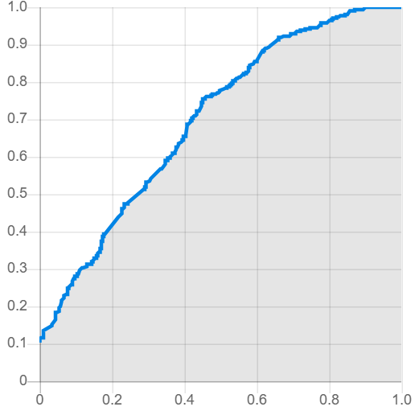

# FOKG Fact Checking System

A supervised fact-checking system for knowledge graphs developed as part of the **Foundations of Knowledge Graphs (FOKG)** mini-project at Paderborn University.

The system predicts the veracity of RDF triples by extracting structural graph features and training a machine learning classifier.

---

## Project Overview

Knowledge graphs often contain noisy or incorrect facts.

This project estimates the probability that a given RDF statement is true.

Pipeline:

RDF Dataset
↓
Parsing
↓
Graph Construction
↓
Feature Engineering
↓
Random Forest Classifier
↓
Truth Score Prediction
↓
GERBIL Submission (.ttl)

---

## Dataset

Training data consists of RDF statements with binary truth labels.

Testing data contains unlabeled RDF statements.

Each statement consists of

- Subject
- Predicate
- Object

Training labels:

- True
- False

---

## Features Used

The model extracts several graph-based features including:

- Head degree
- Tail degree
- Relation frequency
- Head frequency
- Tail frequency
- Shortest path length
- Common neighbors
- Jaccard coefficient
- Graph statistics

---

## Machine Learning Model

Classifier:

- Random Forest

Validation:

- 5-Fold Cross Validation

Evaluation Metric:

- ROC-AUC

---
## Evaluation

The predicted truth values in `result.ttl` were submitted to the
[GERBIL Fact Checking benchmark](https://gerbil-kbc.aksw.org/gerbil/config)
using "SW 2022 Test" as the reference dataset.

**ROC-AUC = 0.697** — exceeding the minimum required threshold of 0.60.



## Team
- Arya Kulkarni — feature engineering, model training, prediction
- Shalmali Karandikar — evaluation, GERBIL submission, documentation

## Project Structure

```
src/
    parse_data.py
    feature_engineering.py
    train_model.py
    predict.py
    generate_result.py
    analyze_data.py
```

---

## Installation

```bash
pip install -r requirements.txt
```

---

## Running the Project

### 1. Parse RDF

```bash
python src/parse_data.py
```

### 2. Generate Features

```bash
python src/feature_engineering.py
```

### 3. Train Model

```bash
python src/train_model.py
```

### 4. Predict Test Truth Scores

```bash
python src/predict.py
```

### 5. Generate GERBIL Submission

```bash
python src/generate_result.py
```

---

## Output

The final prediction file is

```
result.ttl
```

which can be directly submitted to the GERBIL fact-checking benchmark.

---

## Technologies

- Python
- NetworkX
- RDFLib
- Scikit-learn
- Pandas
- NumPy

---
